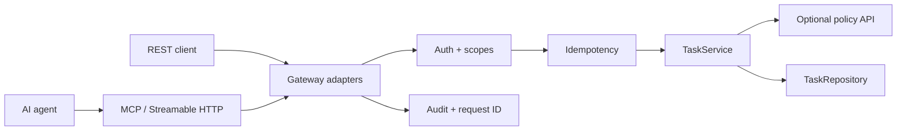

# Agent API Gateway Demo

Production-oriented reference service showing how to expose an existing backend safely to both conventional API clients and AI agents.

The same task capability is available through REST and MCP, while authentication, authorization, idempotency, reliability and auditability stay explicit at the gateway boundary.

## What this demonstrates

- TypeScript / Node.js backend design with strict types.
- REST API and MCP tools backed by the same domain service.
- Bearer authentication with `tasks:read` and `tasks:write` scopes.
- Caller-scoped idempotency for retry-safe agent writes.
- Optimistic locking for stale-write protection.
- Optional upstream policy check with timeout and bounded retry.
- Structured audit logs and end-to-end request correlation.
- Tests for failure paths, not only happy paths.
- A documented AI-assisted review finding where the initial retry boundary was semantically wrong and was corrected with regression coverage.

## Architecture



See [architecture](docs/architecture.md), [threat model](docs/threat-model.md), and [AI review notes](docs/ai-review-notes.md).

## Run locally

Requirements: Node.js 22+.

```bash
npm install
cp .env.example .env
```

Export two non-production demo tokens (the app reads environment variables directly; it does not parse `.env` by itself):

```bash
export DEMO_READ_TOKEN="$(openssl rand -hex 32)"
export DEMO_WRITE_TOKEN="$(openssl rand -hex 32)"
npm run dev
```

The default bind is `127.0.0.1:3000`.

## REST examples

Create a task with a write-scoped token and an idempotency key:

```bash
curl -i http://127.0.0.1:3000/api/tasks \
  -H "Authorization: Bearer $DEMO_WRITE_TOKEN" \
  -H "Idempotency-Key: demo-create-001" \
  -H "Content-Type: application/json" \
  -d '{"title":"Review agent authorization policy"}'
```

Retrying the same request with the same key returns the same task and `Idempotency-Replayed: true`. Reusing the key with a different payload returns `409`.

List tasks with the read-scoped token:

```bash
curl http://127.0.0.1:3000/api/tasks \
  -H "Authorization: Bearer $DEMO_READ_TOKEN"
```

## MCP

The Streamable HTTP endpoint is:

```text
http://127.0.0.1:3000/mcp
```

Authenticate with the same bearer token. The server exposes four intentionally curated tools:

- `tasks_list` — `tasks:read`
- `tasks_get` — `tasks:read`
- `tasks_create` — `tasks:write`, with an idempotency key
- `tasks_complete` — `tasks:write`, with optional expected-version protection

The MCP server uses the current split TypeScript SDK packages and a per-request handler. MCP is an agent-facing contract, not a mechanical mirror of every REST endpoint.

## Verify

```bash
npm run typecheck
npm test
npm run build
```

CI runs the same checks on pushes and pull requests.

## Docker

```bash
docker build -t agent-api-gateway-demo .
docker run --rm -p 3000:3000 \
  -e HOST=0.0.0.0 \
  -e DEMO_READ_TOKEN="$DEMO_READ_TOKEN" \
  -e DEMO_WRITE_TOKEN="$DEMO_WRITE_TOKEN" \
  agent-api-gateway-demo
```

For an internet-facing deployment, configure explicit allowed hosts/origins at the ingress/runtime layer rather than treating the demo's localhost defaults as a deployment policy.

## Deliberate limitations

This is a portfolio-sized reference, not a disguised production system. Tasks and idempotency records are in memory and disappear on restart. Tokens are static demo credentials. A production version should use durable transactional storage, a real OAuth/OIDC issuer, centralized audit storage, metrics/tracing, and deployment-specific host/origin policy.
