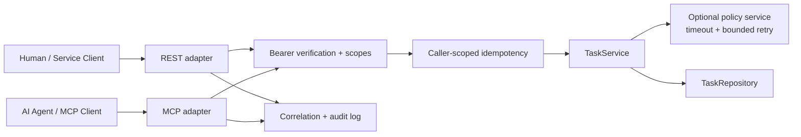

# Architecture

The demo intentionally keeps one business capability behind two transport surfaces. REST and MCP are adapters; neither owns domain logic.

## Boundaries

- `TaskService` owns input normalization and domain operations.
- `TaskRepository` is a port; the demo ships an in-memory adapter only.
- REST routes translate HTTP concerns into domain calls.
- MCP tools expose the same capability with tool-specific schemas and scope challenges.
- Authentication happens before either transport reaches business logic.
- Idempotency keys are scoped by authenticated caller so two clients cannot collide on the same key.
- The optional policy service is treated as an unreliable dependency and protected by timeout and bounded retry.

## Why the MCP layer is not the OpenAPI surface

The MCP tool contract is deliberately narrower than the raw REST surface. Tool names, input schemas, descriptions, authorization scopes and retry-safe write semantics are designed for agent invocation rather than generated mechanically from every HTTP endpoint.

## Production substitutions

A production deployment would replace the in-memory repository and idempotency store with durable storage, usually in the same transactional database as the domain write. Static demo tokens would be replaced by a real OAuth/OIDC authorization server and local JWT verification or RFC 7662 introspection.
